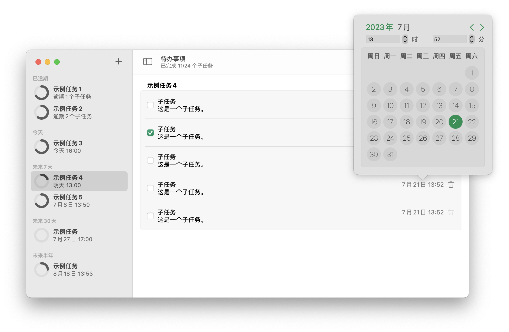

# Task
一款轻量级待办事项应用。

## 下载链接
[macOS平台下载](https://mintlf.pythonanywhere.com)
## TODO
- [x] ~~实现任务的排序和分类功能~~  **1.0.1**
- [x] ~~实现子任务的排序和分类功能~~ **1.0.2**
- [ ] 添加系统通知提醒
- [ ] 添加快捷键相关支持
- [ ] 扩展到iOS平台
- [x] ~~修复任务删除后导航栏右侧依然停留在当前任务的问题~~ **1.0.2**
- [ ] 增加按时间浏览子任务的日历视图
- [ ] 修复子任务顺序修改后日期修改窗口依然弹出的问题
- [ ] 添加更多个性化设置
